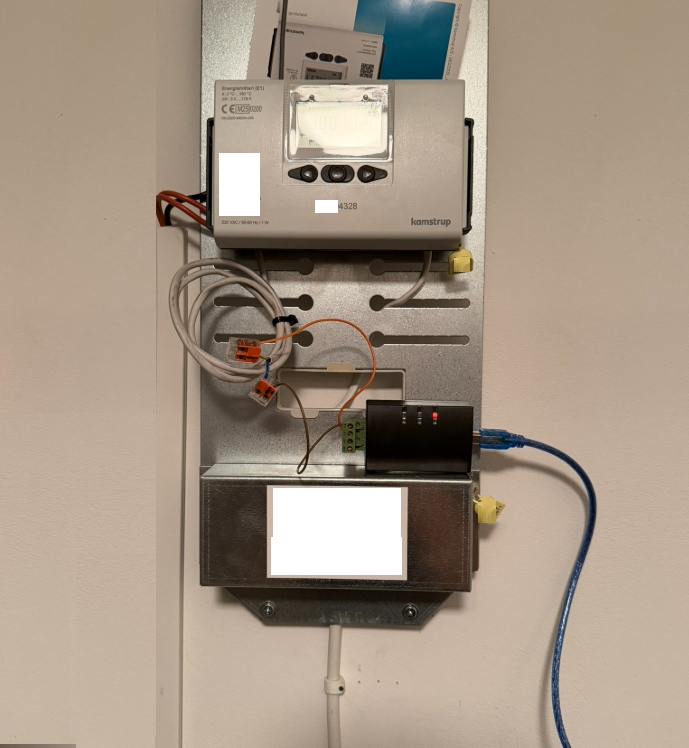

# Kamstrup Multical Modbus REST API

This app reads data from a Kamstrup Multical energy meter using Modbus and exposes it via a REST API.



## Requirements

- Modbus wiring to the Kamstrup device. You may need assistance from your heating company
- USB M-Bus adapter, for example [this one from eBay](https://www.ebay.com/itm/396132088601)

## Docker Compose

The `MBUS_ADDRESS` is the last two or three digits of your Kamstrup serial number. Use `ls /dev/ttyUSB*` on the host to find the correct device path. 

The other settings should work without editing.

```yaml
services:
  restapi:
    image: artop/kamstrup-restapi:latest
    restart: unless-stopped
    devices:
      - "/dev/ttyUSB1:/dev/ttyUSB0" # map the USB device to USB0
    ports:
      - 5000:8080
    environment:
      - MBUS_ADDRESS=0
      - MBUS_BAUD=9600
      - MBUS_PARITY=E
      - MBUS_BYTES=8
      - MBUS_STOP=1
      - MBUS_TIMEOUT=1.0
      - TZ=Europe/Helsinki
```

Edit the environment variables as needed and start the container:

```bash
docker compose up -d

# Verify the results 
curl http://localhost:5000
```

Expected output:
```json
{
  "energy_wh": 1986000,
  "energy_wh_2": 0,
  "fabrication_no": 0,
  "flow_temperature_c": 73.03,
  "manufacturer_spec": 0,
  "manufacturer_spec_2": 0,
  "on_time_seconds": 0,
  "on_time_seconds_2": 0,
  "power_w": 24300,
  "return_temperature_c": 33.82,
  "temperature_difference_k": 39.21,
  "volume_flow_m3_h": 0,
  "volume_m3": 0
}
```

## Build and Run Locally

You can build and run the Docker image locally with the following commands:

```bash
git clone https://github.com/artop123/kamstrup-restapi.git
cd kamstrup-restapi

docker compose build
docker compose up -d
```

## Home Assistant

Once the API is up and running, you can configure a REST sensor in Home Assistant (`configuration.yaml`):

```yaml
rest:
  - resource: http://hostname:5000/
    scan_interval: 300 # every 5 minutes
    sensor:
      - name: "kamstrup_heat_energy_e1"
        unique_id: "kamstrup_heat_energy_e1"
        state_class: total_increasing
        device_class: energy
        unit_of_measurement: "MWh"
        icon: mdi:radiator
        value_template: "{{ value_json['energy_wh'] / 1000 / 1000 }}"
        json_attributes:
          - timestamp

      - name: "kamstrup_temp_in"
        unique_id: "kamstrup_temp_in"
        device_class: temperature
        state_class: measurement
        unit_of_measurement: "°C"
        icon: mdi:thermometer
        value_template: "{{ value_json['flow_temperature_c'] }}"
        json_attributes:
          - timestamp

      - name: "kamstrup_temp_out"
        unique_id: "kamstrup_temp_out"
        state_class: measurement
        device_class: temperature
        unit_of_measurement: "°C"
        icon: mdi:thermometer
        value_template: "{{ value_json['return_temperature_c'] }}"
        json_attributes:
          - timestamp

      - name: "kamstrup_temp_difference"
        unique_id: "kamstrup_temp_difference"
        device_class: temperature
        state_class: measurement
        unit_of_measurement: "°C"
        icon: mdi:thermometer-chevron-up
        value_template: "{{ value_json['temperature_difference_k'] }}"
        json_attributes:
          - timestamp
```